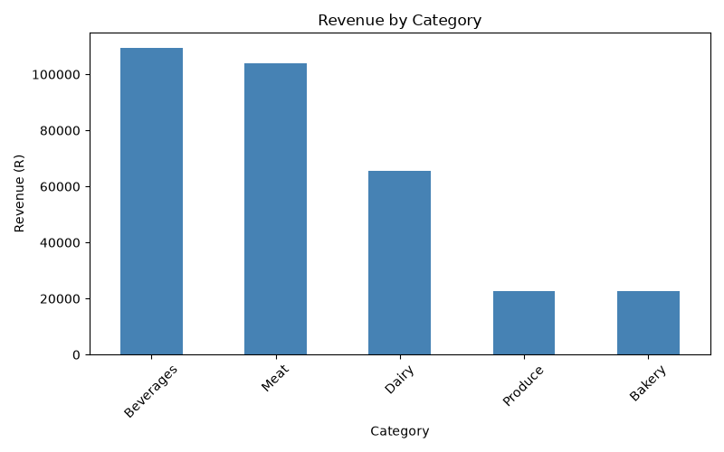

# Retail Sales Analysis

A data analysis of six months of transaction data from a South African grocery
retailer with four stores (Sandton, Rosebank, Soweto, Pretoria). The business
needed to understand which products and categories drive revenue, which store
performs best, how revenue moves month to month, and what actions the
business should take based on that.

**By:** Sandisiwe Luke
**Cohort:** 2026 DS Jan Cohort

## The Dataset

'data/sales_data.csv' contains 600 individual sales transactions recorded
between January and July 2026. Each row records a transaction date, product,
category, store, quantity sold, unit price (in ZAR), and payment method.
There is no revenue column, revenue was calculated as "quantity × unit_price".
The raw file contained deliberate data-quality issues (a missing quantity, a
non-numeric price, a negative quantity, a duplicate row, a badly formatted
date, and inconsistent text casing), all of which were detected and fixed in
code, never edited by hand. 

## How to Run

1. Clone this repository.
2. Install the dependencies:

3. Open `analysis.ipynb` in Jupyter or VS Code and run all cells from top to
   bottom.

## Key Findings

- **Total revenue** across all four stores was **R324,303.00**.
- **Beverages** was the top-earning category (R109,320), followed closely by
  Meat (R104,055); Produce and Bakery trailed well behind at around R22,500
  each.
- **Sandton** was the top-performing store (R89,137.50), narrowly ahead of
  Pretoria and Soweto, with Rosebank clearly behind at R67,184.50.
- **Rooibos Tea 100g** was the best-selling product by volume (570 units),
  but **Coffee Beans 1kg** earned the most revenue (R77,760) — showing that
  a cheaper, high-volume product doesn't necessarily earn the most money.
- **Revenue rose steadily** from R44,140 in January to a peak of R77,000 in
  May, before dipping in June. July shows very low revenue, but that's
  because the dataset only includes one day of that month.

## Recommendations

Head office should consider investing further in **Sandton**, since it is
already the strongest-performing store — building on proven demand carries
less risk than trying to grow a weaker location. Before committing, however,
the business should gather more data: foot traffic per store, store size,
and local competition, since revenue alone doesn't explain *why* Rosebank
lags behind.

## Limitations & Next Steps

This analysis is based on revenue only — there is no cost or profit-margin
data, so we cannot say which categories or stores are most *profitable*,
only which earn the most revenue. There is also no customer-level data (so
we can't tell if sales come from many customers or a few repeat buyers) and
no information on discounts or promotions, which limits how confidently we
can explain spikes like the May peak. A next step would be to combine this
data with cost and customer information for a fuller picture.

## Tools Used

- **Python** — pandas for data cleaning and analysis, Matplotlib for
  visualisation
- Skills applied: control flow, functions and reusable code (Python
  Essentials 1), file handling and the pandas/Matplotlib libraries (Python
  Essentials 2), and end-to-end data analysis and critical thinking (Data
  Science capstone)